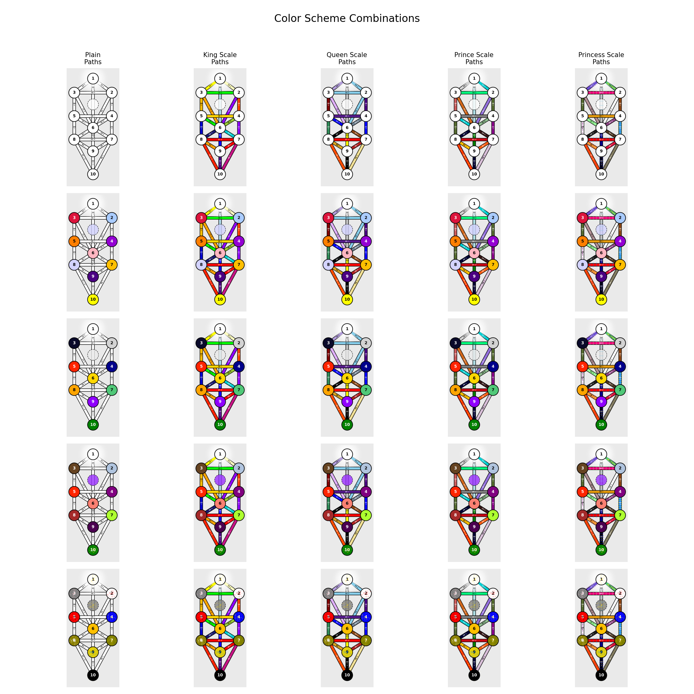
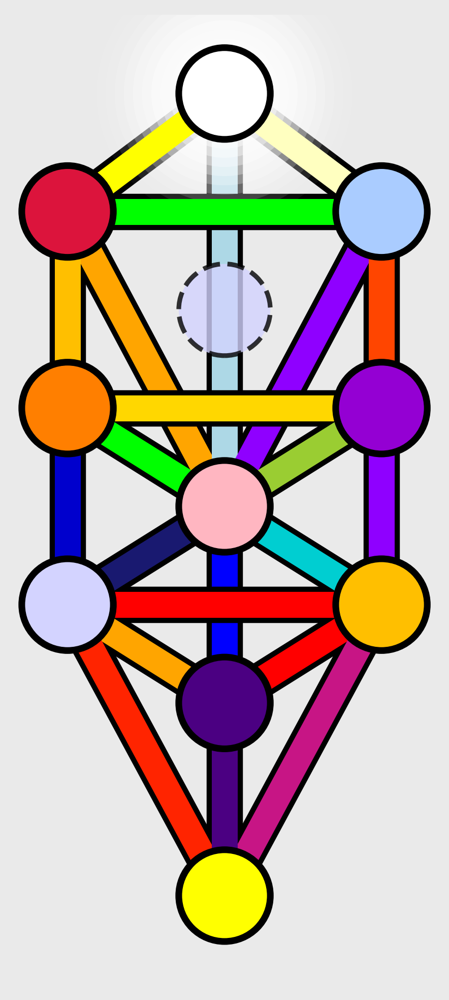
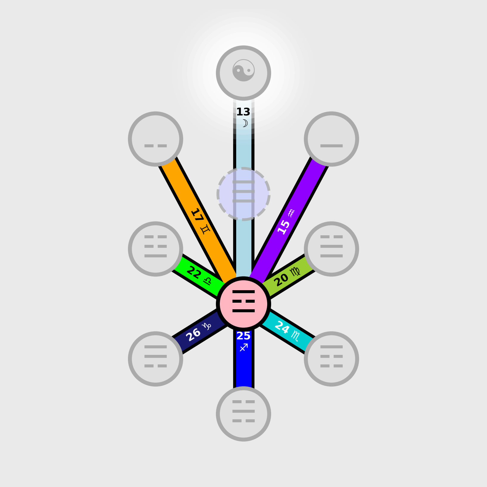
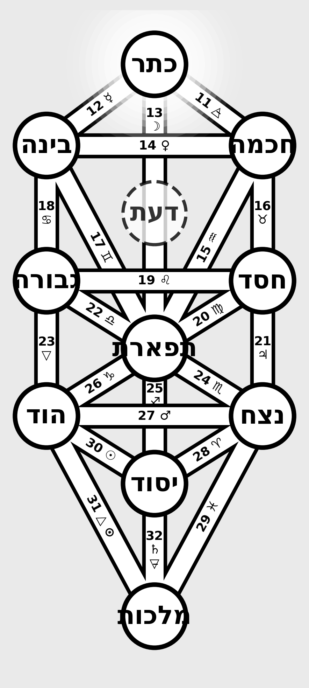

# Tree of Life Visualization

A Python library for generating customizable diagrams of the Kabbalistic Tree of Life.



## Overview

The Tree of Life (עץ החיים) is a mystical symbol used in the Kabbalah tradition, representing the path to spiritual enlightenment and a map of the universe. It consists of 10 nodes called Sephiroth (singular: Sephirah) connected by 22 paths, each associated with various mystical and esoteric meanings.

This library provides a flexible, object-oriented implementation for rendering the Kabbalistic Tree of Life. It supports:

- Multiple color schemes (Plain, King Scale, Queen Scale, Prince Scale, Princess Scale)
- Focusing on individual Sephiroth with connected paths
- Special color effects (flecked, rayed, tinged)
- Dynamic text coloring for optimal readability
- Multiple text display modes (numbers, Hebrew, I Ching trigrams, planetary symbols)
- Text visibility toggles for both Sephiroth and Paths
- High-quality output for both display and saving to file
- Modular architecture with separation of concerns

### Visual Examples

Here are some examples of the different visualization options:

| Description            | Example                                                                       |
| ---------------------- | ----------------------------------------------------------------------------- |
| Full Tree (King Scale) |       |
| Focus on Tiphereth     |      |
| Hebrew Text Mode       |         |
| Planetary Symbols      |  |

## Project Structure

The codebase is organized into modules with clear separation of concerns:

- `TreeOfLife.py`: The main class that handles the tree structure and rendering functionality
- `color_utils.py`: Contains color-related functionality including schemes, effects, and parsing
- `color_scales.yaml`: Defines the color schemes and special effects for Sephiroth and Paths
- `demonstration.py`: Example script demonstrating the library's capabilities
- `treegen.py`: Interactive CLI tool for configuring and generating Tree of Life visualizations

This modular architecture makes the code more maintainable and allows for easier extension.

## Installation

### Requirements

- Python 3.11+
- matplotlib
- numpy
- PyYAML
- Pillow
- rich

Install the required packages:

```bash
pip install -r requirements.txt
```

### Local Installation

To install the package for development:

```bash
# Clone the repository
git clone https://github.com/tjr214/tol-gen.git
cd tol-gen

# Install in development mode
# pip install -e .
```

## Usage

### Command Line Interface (treegen.py)

The project includes a powerful interactive CLI tool (`treegen.py`) for configuring, saving, loading, and rendering Tree of Life visualizations:

```bash
# Display help screen
./treegen.py

# Interactive configuration mode (prompts for saving location)
./treegen.py --new

# Interactive configuration mode (saves to specified file)
./treegen.py --new my_config.yaml

# Load existing configuration and render
./treegen.py existing_config.yaml

# Load existing configuration and display instead of saving
./treegen.py existing_config.yaml --display
```

The CLI tool provides:

- Interactive step-by-step configuration with colorful prompts
- Save/load configurations as YAML files
- Multiple color scheme selection
- Text display customization
- Focus mode configuration
- High-quality rendering options
- Intelligent file naming

Configurations are saved to YAML files for reuse, and rendered images are saved to the `output` directory by default.

### Command Line Demo

To run the demonstration script that generates all example visualizations:

```bash
python demonstration.py
```

This will create a variety of example files in the `sample-output` directory, showing different aspects of the library.

### Basic Usage

```python
from tol import TreeOfLife, ColorScheme

# Create a Tree of Life instance with default settings
tree = TreeOfLife()

# Render the tree with default (plain) colors
tree.render(display=True)

# Save the tree to a file
tree.render(display=False, save_to_file="tree_of_life.png")

# Change color schemes
tree.set_sephiroth_color_scheme(ColorScheme.KING_SCALE)
tree.set_path_color_scheme(ColorScheme.KING_SCALE)

# Render with the new color scheme
tree.render(display=True, save_to_file="tree_king_scale.png")
```

### Focus on Specific Sephiroth

You can render a view that focuses on a specific Sephirah, showing only its connected paths and adjacent Sephiroth:

```python
# Focus on Tiphereth (6)
tree.render(focus_sephirah=6, display=True, save_to_file="tiphereth_focus.png")

# Focus on Kether (1)
tree.render(focus_sephirah=1, display=True, save_to_file="kether_focus.png")
```

### Mixing Color Schemes

You can use different color schemes for Sephiroth and Paths:

```python
# Use Queen Scale for Sephiroth and Prince Scale for Paths
tree.set_sephiroth_color_scheme(ColorScheme.QUEEN_SCALE)
tree.set_path_color_scheme(ColorScheme.PRINCE_SCALE)
tree.render(display=True)
```

### Customizing Rendering Parameters

```python
# Customize figure size and DPI
tree.render(
    display=True,
    save_to_file="high_res_tree.png",
    figsize=(10, 15),  # Width, height in inches
    dpi=600,          # High resolution
    show_title=True   # Display title on the diagram
)

# Render without a title
tree.render(
    display=True,
    save_to_file="tree_no_title.png",
    show_title=False  # Hide the title
)
```

The `show_title` parameter (default is `False`) controls whether titles are displayed on the diagram:

- When `show_title=True` and a specific Sephirah is focused, the title will display "Focus on [Sephirah Name] (Sephirah [Number])"
- When `show_title=True` and no Sephirah is focused, no title will be displayed
- When `show_title=False`, no title will be displayed in any case

### Text Rendering Options

The TreeOfLife class provides several options for customizing text rendering:

#### Text Display Modes for Sephiroth

You can switch between different display modes for Sephiroth text:

```python
# Display traditional numbers (1-10, default)
tree.set_sephiroth_text_mode(tree.SephirothTextMode.NUMBER)

# Display I Ching trigrams
tree.set_sephiroth_text_mode(tree.SephirothTextMode.TRIGRAM)

# Display Hebrew names of Sephiroth
tree.set_sephiroth_text_mode(tree.SephirothTextMode.HEBREW)

# Display planetary symbols
tree.set_sephiroth_text_mode(tree.SephirothTextMode.PLANET)
```

#### Text Visibility Controls

You can toggle text visibility for both Sephiroth and Paths:

```python
# Hide Sephiroth text (numbers/symbols)
tree.set_sephiroth_text_visibility(False)

# Hide Path text (numbers and astrological symbols)
tree.set_path_text_visibility(False)

# Show the diagram with no text
tree.render()

# Re-enable text
tree.set_sephiroth_text_visibility(True)
tree.set_path_text_visibility(True)
```

These settings work in both normal and focused views, giving you complete control over the visual presentation of your Tree of Life diagrams.

### Path Numbering and Symbols

The 22 paths in the Tree of Life (numbered 11-32) are traditionally associated with the Hebrew alphabet and astrological symbols. The library automatically renders these paths with both their traditional number and the corresponding symbol:

- Paths 11-31: Hebrew letters and their astrological/elemental correspondences
- Path 32: Saturn (♄), associated with the Hebrew letter Tav (ת)

The path text is automatically positioned along each path with correct orientation for readability.

## Example Scripts

This repository includes a comprehensive demonstration script:

- `demonstration.py`: Comprehensive demonstration of all features

Run the demonstration script to generate examples of all supported features:

```bash
python demonstration.py
```

This will create a range of example files in the `sample-output` directory.

## Color System

The color system is now implemented in a separate module (`color_utils.py`), making it easy to:

- Add new color schemes
- Implement custom color effects
- Modify color parsing logic without affecting the main Tree of Life structure

### Dynamic Text Color

The visualization automatically adjusts text colors based on the background brightness:

- For light-colored backgrounds, black text is used
- For dark-colored backgrounds, white text is used
- This ensures optimal readability regardless of the background color

This feature works for both Sephiroth numbers and Path numbers/symbols, and maintains the current behavior for non-focused elements (which are grayed out).

### Color Schemes

The TreeOfLife class supports the following color schemes:

- **Plain**: Default colors based on the original implementation
- **King Scale**: Corresponds to the elemental/planetary associations in Atziluth (World of Archetypes)
- **Queen Scale**: Corresponds to the elemental/planetary associations in Briah (World of Creation)
- **Prince Scale**: Corresponds to the elemental/planetary associations in Yetzirah (World of Formation)
- **Princess Scale**: Corresponds to the elemental/planetary associations in Assiah (World of Action/Material)

Color definitions are loaded from `color_scales.yaml`, which allows for easy customization of colors without modifying the code.

### Special Color Effects

The implementation supports special color effects found in the traditional color scales:

- **Flecked**: Colors flecked or dotted with particles of another color
- **Rayed**: Colors with rays of another color emanating from it
- **Tinged**: Colors slightly modified with a tinge of another color

## Extending the Codebase

The modular architecture makes it easy to extend the functionality:

1. To add new color schemes: Update the `ColorScheme` enum and corresponding entries in `color_scales.yaml`
2. To add new color effects: Implement the effect in the `apply_color_effect` and `apply_path_effect` functions
3. To modify the Tree structure: Update the appropriate methods in the `TreeOfLife` class

## License

This code is available for academic and personal magickal use.

## Acknowledgments

This implementation is a refactoring of the original `new_tree.py` script (also created by the author), enhancing it with object-oriented design, greater flexibility, richer visualization options, and a modular architecture.
