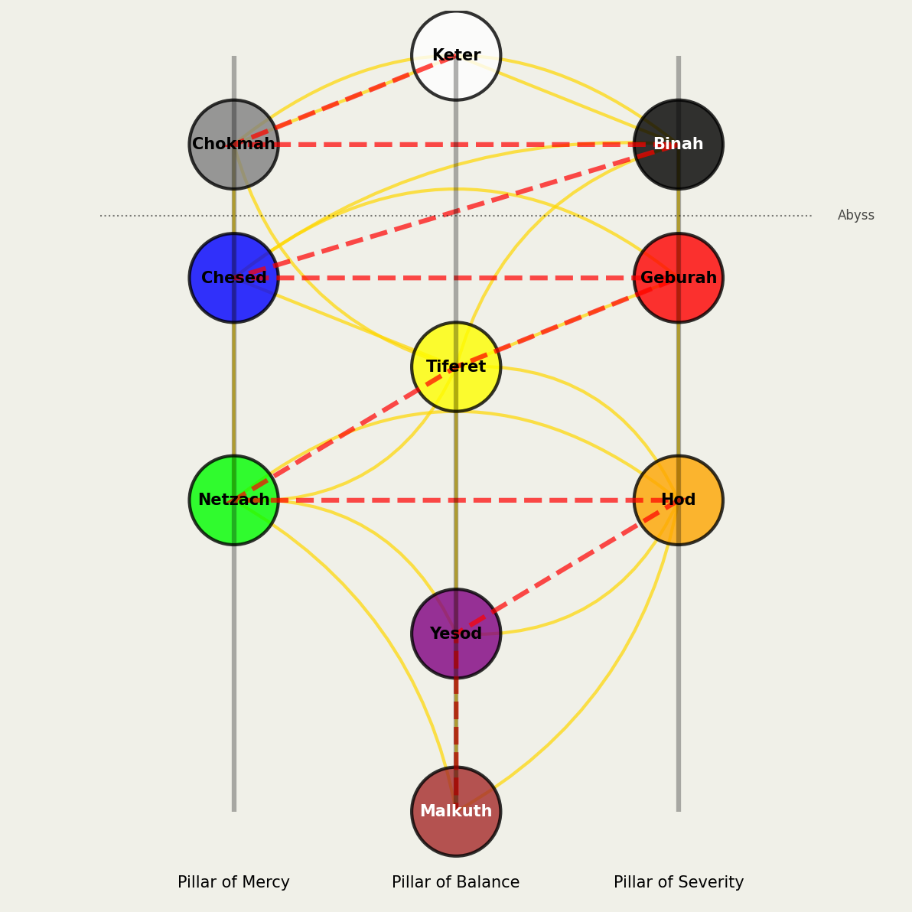

# Kircher Tree of Life

This Python program generates a visualization of Athanasius Kircher's version of the Kabbalistic Tree of Life. The visualization accurately represents the 10 Sephirot (nodes) and the paths connecting them, with special attention to making the paths look like actual paths rather than simple lines.



## About the Kircher Tree of Life

Athanasius Kircher (1602-1680) was a German Jesuit scholar who published his interpretation of the Kabbalistic Tree of Life in the mid-17th century. His version has become one of the standard representations in Western esoteric traditions.

The Tree of Life in Kabbalah represents the process of divine creation and the spiritual path of ascent. It consists of:

- **10 Sephirot**: Divine emanations or attributes
- **22 Paths**: Connections between the Sephirot
- **3 Pillars**: Mercy (right), Balance (middle), and Severity (left)
- **The Flaming Sword**: The zigzag path showing the order of divine emanation
- **The Abyss**: A conceptual division between the upper and lower Sephirot

## Features

- Accurate representation of the Kircher Tree of Life structure
- Curved paths that look like actual paths, not just straight lines
- Colored Sephirot according to traditional attributions
- Visualization of the three pillars
- Visualization of the "Flaming Sword" path
- High-quality image output

## Requirements

- Python 3.6+
- matplotlib
- numpy
- Pillow

## Installation

1. Clone this repository:

```bash
git clone https://github.com/yourusername/kircher-tree.git
cd kircher-tree
```

2. Install the required dependencies:

```bash
pip install -r requirements.txt
```

## Usage

Run the script to generate and display the visualization:

```bash
python kircher_tree.py
```

This will display the visualization and save it as `kircher_tree_of_life.png` in the current directory.

## Customization

You can customize the visualization by modifying the `KircherTreeOfLife` class:

- Change the colors of Sephirot in the `sephirot_colors` dictionary
- Adjust the positions in the `sephirot_positions` dictionary
- Modify the paths in the `paths` list
- Change the figure size and DPI in the constructor

Example:

```python
# Create a larger visualization with higher resolution
tree = KircherTreeOfLife(figsize=(15, 20), dpi=300)

# Draw with a custom title
tree.draw(title="My Custom Kircher Tree of Life")

# Save to a custom location
tree.save("my_tree_of_life.png")
```

## Structure of the Tree

In the Kircher Tree of Life:

1. **Keter** (Crown): The highest Sephirah, representing divine will
2. **Chokmah** (Wisdom): The active, masculine force
3. **Binah** (Understanding): The passive, feminine force
4. **Chesed** (Mercy): Loving-kindness and benevolence
5. **Geburah** (Severity): Discipline and judgment
6. **Tiferet** (Beauty): Harmony and balance
7. **Netzach** (Victory): Endurance and triumph
8. **Hod** (Splendor): Majesty and surrender
9. **Yesod** (Foundation): The collection and balancing of the forces above it
10. **Malkuth** (Kingdom): The physical world and reality as we experience it

## License

MIT

## References

- Kircher, Athanasius. (1652-1654). _Oedipus Aegyptiacus_.
- Scholem, Gershom. (1991). _On the Mystical Shape of the Godhead: Basic Concepts in the Kabbalah_.
- Regardie, Israel. (2000). _A Garden of Pomegranates: Skrying on the Tree of Life_.
