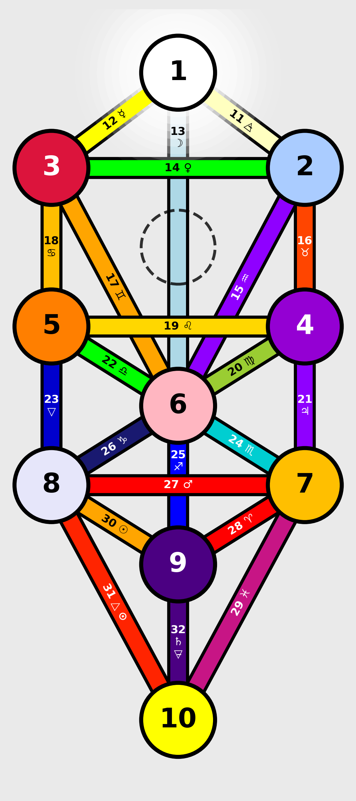

# Tree of Life Visualization

A Python library for generating customizable diagrams of the Kabbalistic Tree of Life.



## Overview

This library provides a flexible, object-oriented implementation for rendering the Kabbalistic Tree of Life. It supports:

- Multiple color schemes (Plain, King Scale, Queen Scale, Prince Scale, Princess Scale)
- Focusing on individual Sephiroth with connected paths
- Special color effects (flecked, rayed, tinged)
- High-quality output for both display and saving to file
- Modular architecture with separation of concerns

## Project Structure

The codebase is organized into modules with clear separation of concerns:

- `TreeOfLife.py`: The main class that handles the tree structure and rendering functionality
- `color_utils.py`: Contains color-related functionality including schemes, effects, and parsing

This modular architecture makes the code more maintainable and allows for easier extension.

## Installation

### Requirements

- Python 3.6+
- matplotlib
- numpy
- PyYAML
- Pillow

Install the required packages:

```bash
pip install -r requirements.txt
```

## Usage

### Basic Usage

```python
from TreeOfLife import TreeOfLife
from color_utils import ColorScheme

# Create a Tree of Life instance with default settings
tree = TreeOfLife()

# Render the tree with default (plain) colors
tree.render(display=True)

# Save the tree to a file
tree.render(display=False, save_to_file="tree_of_life.png")

# Change color schemes
tree.set_sephiroth_color_scheme(ColorScheme.KING_SCALE)
tree.set_path_color_scheme(ColorScheme.KING_SCALE)

# Render with the new color scheme
tree.render(display=True, save_to_file="tree_king_scale.png")
```

### Focus on Specific Sephiroth

You can render a view that focuses on a specific Sephirah, showing only its connected paths and adjacent Sephiroth:

```python
# Focus on Tiphereth (6)
tree.render(focus_sephirah=6, display=True, save_to_file="tiphereth_focus.png")

# Focus on Kether (1)
tree.render(focus_sephirah=1, display=True, save_to_file="kether_focus.png")
```

### Mixing Color Schemes

You can use different color schemes for Sephiroth and Paths:

```python
# Use Queen Scale for Sephiroth and Prince Scale for Paths
tree.set_sephiroth_color_scheme(ColorScheme.QUEEN_SCALE)
tree.set_path_color_scheme(ColorScheme.PRINCE_SCALE)
tree.render(display=True)
```

### Customizing Rendering Parameters

```python
# Customize figure size and DPI
tree.render(
    display=True,
    save_to_file="high_res_tree.png",
    figsize=(10, 15),  # Width, height in inches
    dpi=600           # High resolution
)
```

## Example Scripts

This repository includes two example scripts:

- `example_usage.py`: Basic examples of using the TreeOfLife class
- `demonstration.py`: Comprehensive demonstration of all features

Run the demonstration script to generate examples of all supported features:

```bash
python demonstration.py
```

This will create a range of example files in the `output` directory.

## Color System

The color system is now implemented in a separate module (`color_utils.py`), making it easy to:

- Add new color schemes
- Implement custom color effects
- Modify color parsing logic without affecting the main Tree of Life structure

### Color Schemes

The TreeOfLife class supports the following color schemes:

- **Plain**: Default colors based on the original implementation
- **King Scale**: Corresponds to the elemental/planetary associations in Atziluth (World of Archetypes)
- **Queen Scale**: Corresponds to the elemental/planetary associations in Briah (World of Creation)
- **Prince Scale**: Corresponds to the elemental/planetary associations in Yetzirah (World of Formation)
- **Princess Scale**: Corresponds to the elemental/planetary associations in Assiah (World of Action/Material)

Color definitions are loaded from `color_scales.yaml`, which allows for easy customization of colors without modifying the code.

### Special Color Effects

The implementation supports special color effects found in the traditional color scales:

- **Flecked**: Colors flecked or dotted with particles of another color
- **Rayed**: Colors with rays of another color emanating from it
- **Tinged**: Colors slightly modified with a tinge of another color

## Extending the Codebase

The modular architecture makes it easy to extend the functionality:

1. To add new color schemes: Update the `ColorScheme` enum and corresponding entries in `color_scales.yaml`
2. To add new color effects: Implement the effect in the `apply_color_effect` and `apply_path_effect` functions
3. To modify the Tree structure: Update the appropriate methods in the `TreeOfLife` class

## License

This code is available for academic and personal use.

## Acknowledgments

This implementation is a refactoring of the original `new_tree.py` script, enhancing it with object-oriented design, greater flexibility, richer visualization options, and a modular architecture.
